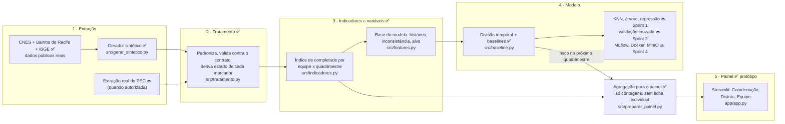

# Arquitetura · Painel de Equidade em Saúde do Recife

> Estado em 26/09/2026 (Consolidação técnica do MVP, S06). ✅ = pronto · 🔜 = próximas sprints.

## A ideia central: uma linha de produção de dados

A Secretaria hoje extrai relatórios do PEC **unidade por unidade**, monta tudo à mão em Excel e a última consolidação foi feita há mais de um ano. A solução substitui esse processo por uma sequência de etapas automáticas: entra o cadastro bruto, sai o indicador por equipe, a previsão de risco e o painel.

Cada etapa lê o que a anterior gravou em disco. Por isso **a origem do dado pode mudar sem mexer no resto**: hoje a Estação 1 é um gerador sintético; quando houver extração real do PEC no formato de `docs/contrato_dados.md`, só ela é trocada.



## As estações

| # | Estação | Entrada | Saída | Status |
|---|---|---|---|---|
| 1 | **Extração** | CNES (unidades), mapa de bairros do Recife, Censo 2022 | `data/raw/territorio_equipes.csv`, `data/raw/fichas_cadastro.parquet` | ✅ sintético · 🔜 extração real |
| 2 | **Tratamento** | fichas brutas | `data/processed/fichas_tratadas.parquet` + relatório de problemas | ✅ |
| 3 | **Indicadores e variáveis** | fichas tratadas | índice por equipe x quadrimestre; `data/processed/base_modelo.parquet` | ✅ |
| 4 | **Modelo** | base do modelo | baselines (`notebooks/resultados/baseline.csv`); modelos e experimentos | ✅ baseline · 🔜 modelos |
| 4→5 | **Agregação para o painel** | fichas tratadas, indicadores | `app/dados/*.parquet` (~300 KB, só contagens por equipe, USF e distrito) | ✅ |
| 5 | **Painel** | `app/dados/` | protótipo navegável com 3 perfis, publicado no Streamlit Community Cloud | ✅ protótipo · 🔜 dashboard final (Sprint 3) |

## Decisões de arquitetura (e por quê)

| Decisão | Por quê |
|---|---|
| **Contrato de dados antes do código** | Sem acesso ao PEC, o formato é o que liga o projeto à Secretaria. O pipeline inteiro depende só dele |
| **Unidade de análise = equipe x quadrimestre** | A média da unidade ou do distrito esconde equipes críticas (pedido central da cliente em 01/09). Quadrimestre porque a cliente disse que acompanhamento a cada 4 meses basta |
| **Fichas, não pessoas** | A qualidade de um período mede o que a equipe preencheu naquele período, e não o estoque acumulado de anos |
| **Três estados por marcador** (preenchido, recusou, não perguntado) | "Recusou" é escolha da pessoa; "não perguntado" é falha da equipe. Só o segundo se resolve com formação |
| **Fórmulas num único módulo** (`indicadores.py`) | O número do painel é exatamente o mesmo que o modelo aprendeu |
| **Divisão treino/teste temporal** | Sortear linhas deixaria o modelo aprender com o futuro de uma equipe para prever o passado dela |
| **Arquivos Parquet em disco entre as estações** | Simples, rápido e reproduzível: cada etapa pode ser rodada e inspecionada sozinha. Banco de dados entra se a extração real exigir |
| **Semente fixa no gerador** | Rodar de novo gera exatamente a mesma base: qualquer resultado pode ser reproduzido |
| **Painel lê só dados agregados** (`preparar_painel.py`) | Privacidade (o painel nunca toca em ficha de pessoa) e leveza: ~300 KB em vez de 770 mil fichas, o que reduziu a memória do painel de ~2 GB para ~250 MB e permitiu publicá-lo na nuvem |
| **Nenhum dado individual no painel** | Raça, orientação sexual, identidade de gênero e deficiência são dados sensíveis (LGPD, art. 5º, II). Tudo é agregado por equipe, unidade ou distrito |

## Tecnologias

| Camada | Tecnologia | Por quê |
|---|---|---|
| Linguagem | Python 3.12 | Exigência da disciplina; ecossistema de dados e ML |
| Dados | pandas + Parquet (pyarrow) | Tabelas de ~770 mil linhas em segundos, sem servidor |
| ML | scikit-learn | Modelos da disciplina (KNN, árvore, regressão) e métricas |
| Análise | Jupyter + matplotlib | Notebooks executados de ponta a ponta, com saídas gravadas |
| Painel | Streamlit + Altair + pydeck | Painel web interativo em Python, com mapa e gráficos com tooltip |
| Experimentos 🔜 | MLflow, Docker, MinIO | Registro de experimentos e reprodutibilidade (Sprint 4) |

## Como rodar tudo do zero

```bash
python src/gerar_sintetico.py   # Estação 1 · ~5 s
python src/tratamento.py        # Estação 2 · ~3 s
cd src && python features.py && python baseline.py && python preparar_painel.py && cd ..   # Estações 3 e 4 + agregação
streamlit run app/app.py        # Estação 5 · abre no navegador
```
